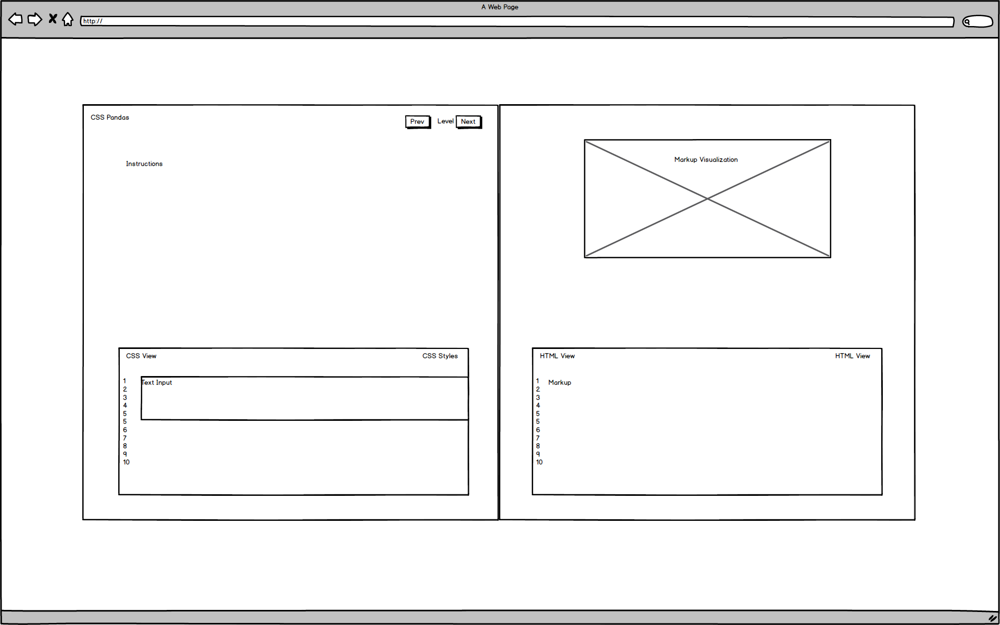

## CSS Demos

### Background

This project is a demonstration of CSS animations through interactive examples and viewable source code. There are various types of CSS represented, from animations to visualized examples of CSS concepts.

The project will show the example and have a toggle button to display the source code for viewers to copy and paste into their site for personal use.

### Functionality & MVP  

With this CSS demonstration project, users will be able to:

- [ ] Interact with the CSS animations
- [ ] Learn about CSS principles
- [ ] View source code

In addition, this project will include:

- [ ] A production Readme

### Wireframes

This app will be a single page with nav links to the Github, my LinkedIn, and a description of what the project entails. The page will have index links to the various CSS concepts at the top of the page which auto-directs you to the CSS concept upon clicking.

### Architecture and Technologies

This project will be implemented with the following technologies:

- Vanilla JavaScript and CSS for the visual rendering of CSS animations and concepts.

### Implementation Timeline

**Day 1**: Choose which CSS animations/concepts to demonstrate and visualize. Read up and learn more about said concepts/see code demos of the animations. Get basic HTML view up and start the layout, structure for the main page. Goals for the day:

- Get main HTML view set up.
- Choose concepts/animations to visualize
- Read up and research the concepts more.

**Day 2**: Start building out the animations and concepts one by one. Choose a color palette and typeface for the project and start implementing that as well. Work on easier concepts/animations to not get bogged down early on. Goals for the day:

- Get at least 1-2 animations/concepts done and visualized on the page.
- Figure out how to toggle source code to make it viewable
- Choose typeface and color palette for project if not done already.

**Day 3** Work more on the animations/concepts and implementing them into the project. Start to build out the harder visualizations, making sure there is at least one "wow" concept in there (3D or otherwise). Goals for the day:

- Explore implementations of harder to visualize concepts.
- Research code on 3D or other "wow" concepts.
- Finish up 2-3 more of the simple animations/concepts.

**Day 4**: Finish up a harder concept and implement it into the page. Finish up styling. Add relevant links into the page. Make it visually appealing. Goals for the day:

- Implement hard CSS concept.
- Polish page to make it presentational.
- If time: add another 1-2 CSS demos.
